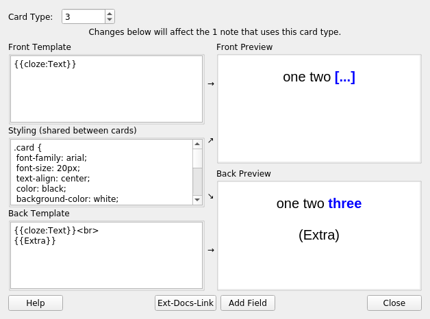

# Preview any cloze

## Rationale
When you edit a card template, you want to be able to preview it in
real time. With Cloze deletion, by default, you can only preview the
first card. That's strange, I believe.

With this add-on, you can select the cloze number you'll be
previewing.

I believe that this is mostly useful if you ever use conditions, such
as {{#c ... }} {{/c ...}} and {{^c ... }} {{/c ...}}, which show a
different content depending on the card number.

## Internal
In `aqt.clayout.CardLayout`, it changes the methods:
* `redraw`
* `setupTopArea`
* `onCardSelected`
* `updateMainArea`
The following methods are also changed, and the previous version of the
method is called.
* `__init__`
* `updateCardNames`

## Version 2.0
None

## Links, licence and credits

Key         |Value
------------|-------------------------------------------------------------------
Copyright   | Arthur Milchior <arthur@milchior.fr>
Based on    | Anki code by Damien Elmes <anki@ichi2.net>
License     | GNU AGPL, version 3 or later; http://www.gnu.org/licenses/agpl.html
Source in   | https://github.com/Arthur-Milchior/anki-any-cloze-in-preview
Addon number| [915063177](https://ankiweb.net/shared/info/915063177)
Support me on|  or 
